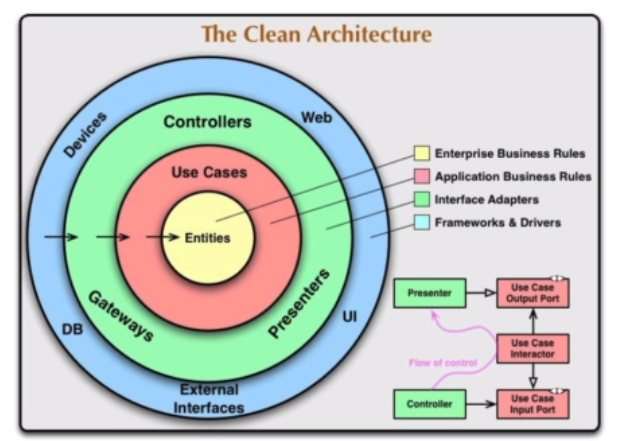

## Clean Arcitecture
    Terminal Application

# 4 Layer
1. Web Dekstop / View 
2. Service            
3. Repository         
4. Entitiy            

## Step by step
1. Create Entity
2. Bussiness Logic
    - Create Repository
    - Create Service
    - Create View
3. Util is Help Class
